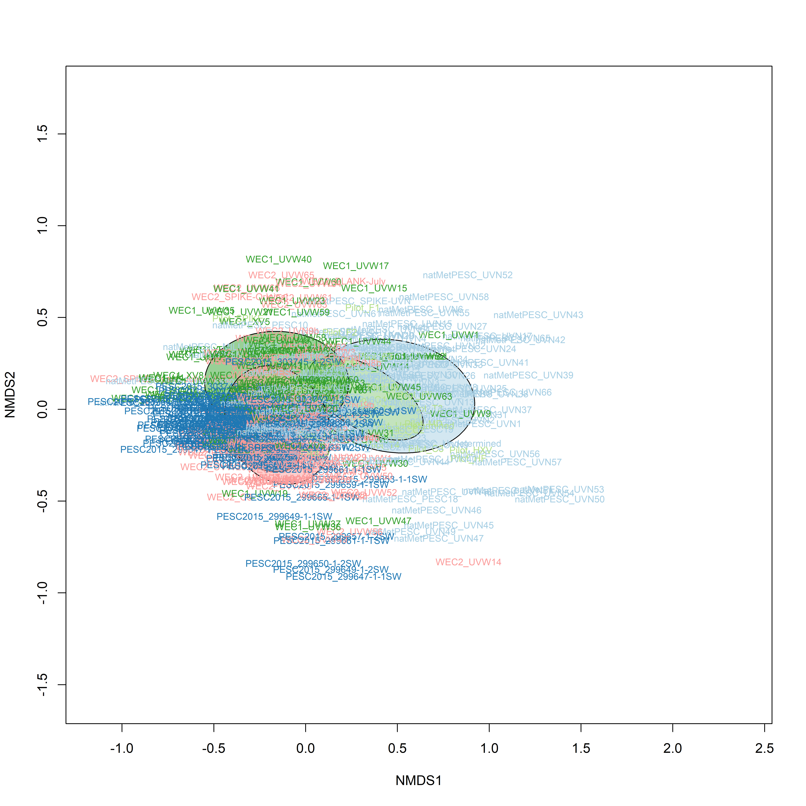
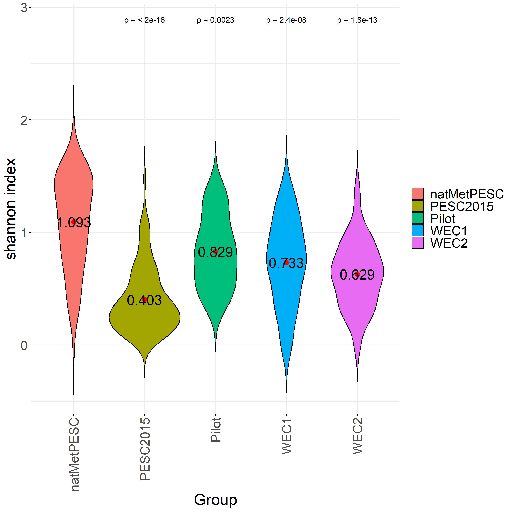
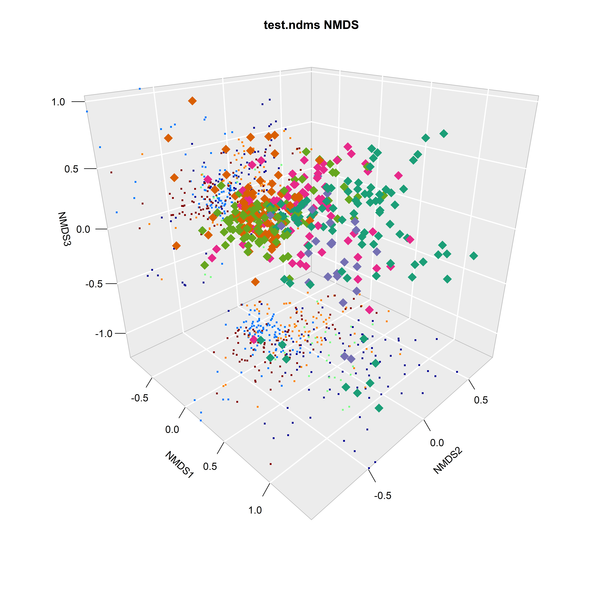

{#fig:methodology_overview width="6.5in"}

{#fig:kmer_threshold width="6.5in"}

![**Relative Abundance of 16S Microbiomes at the Bacterial Phylum Level**. The relative abundance of the top 10 bacterial phyla present across all samples represents >99% of all reads sequenced. The  tadpole skin microbiome (labelled 1-23) consisted of predominately Proteobacteria (Purple). However, as life stage progresses, froglets are dominated by Verrucomicrobia. The relative distribution of phyla in the positive control (labelled POS) is as expected. Sterile swabs (labelled SSC) and negative controls (labelled NSC) have <2k reads on average. ](images/phylum_label.png){#fig:phylum_combined width="6.5in"}

{#fig:alpha_diversity width="6.5in"}

{#fig:bray_nmds width="6.5in"}

{#fig:bray_nmds_cluster width="6.5in"}

{#fig:sex_mass_length width="6.5in"}

{#fig:alpha_diversity_t width="6.5in"}

{#fig:nmds_t width="6.5in"}

{#fig:nmds_t_cluster width="6.5in"}
