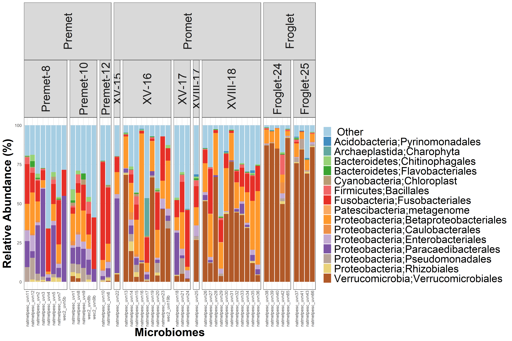
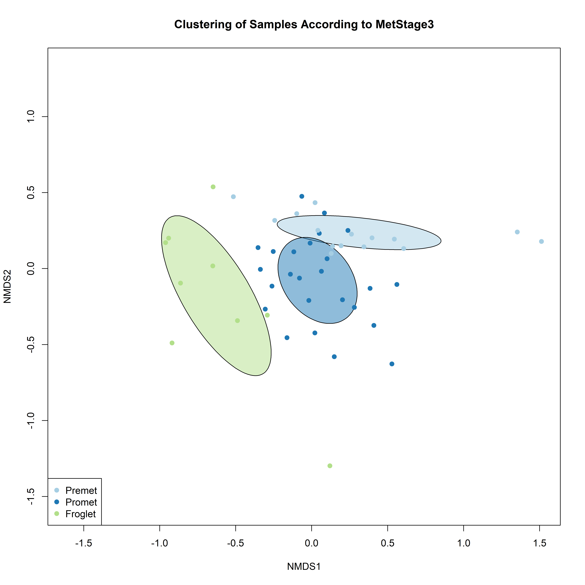
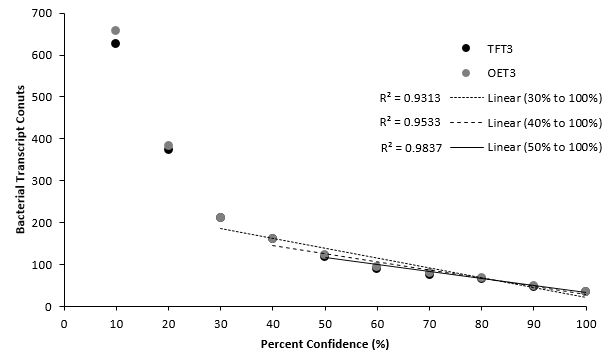

{#fig:barplot_phylumall width="6.5in"}

{#fig:cluster_source width="6.5in"}

{#fig:barplot_phylumnatural width="6.5in"}

{#fig:barplot_genusnatural width="6.5in"}

{#fig:cluster_natural width="6.5in"}

{#fig:difexpr_phylumnatural width="6.5in"}

{#fig:alphadiv_natural width="6.5in"}

{#fig:barplot_phylumnatural width="6.5in"}

{#fig:@fig:cluster_sex width="6.5in"}

{#fig:cluster_exposure width="6.5in"}

{#fig:@fig:alphadiv_t4 width="6.5in"}

{#fig:methodology_overview width="6.5in"}

{#fig:kmer_threshold width="6.5in"}

![**Relative Abundance of 16S Microbiomes at the Bacterial Phylum Level**. The relative abundance of the top 10 bacterial phyla present across all samples represents >99% of all reads sequenced. The  tadpole skin microbiome (labelled 1-23) consisted of predominately Proteobacteria (Purple). However, as life stage progresses, froglets are dominated by Verrucomicrobia. The relative distribution of phyla in the positive control (labelled POS) is as expected. Sterile swabs (labelled SSC) and negative controls (labelled NSC) have <2k reads on average. ](images/phylum_label.png){#fig:phylum_combined width="6.5in"}
