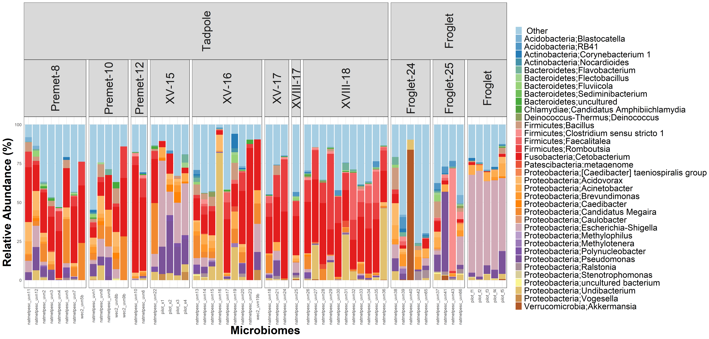
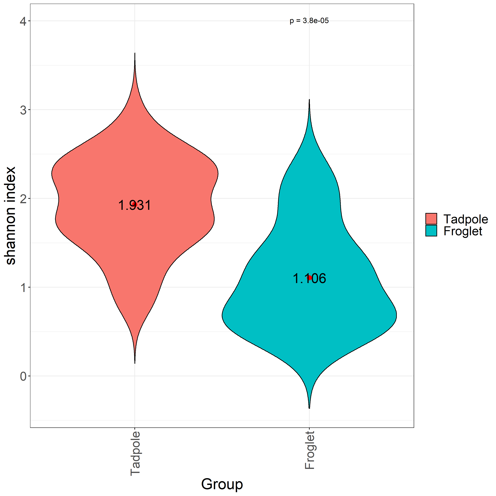
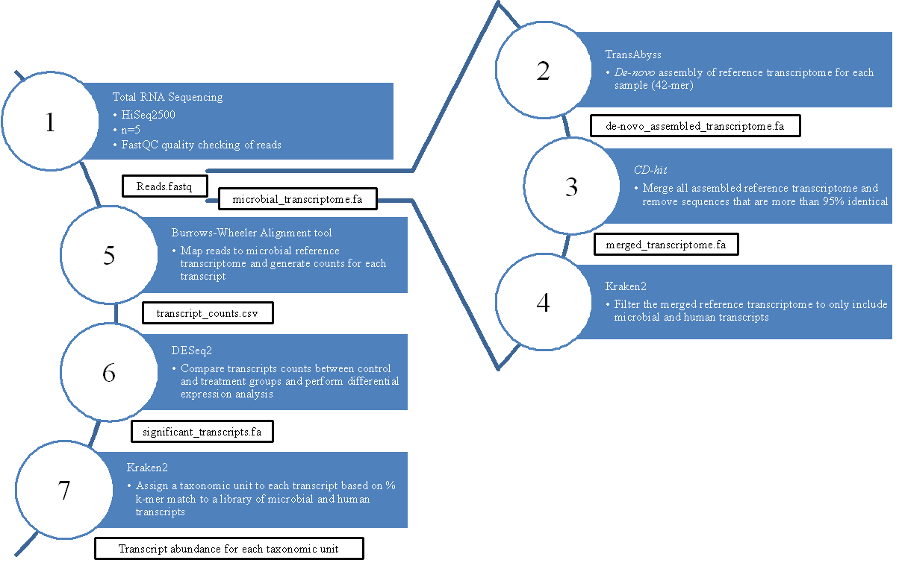

---
title: Manuscript Title
keywords:
- markdown
- publishing
- manubot
lang: en-US
date-meta: '2021-06-02'
author-meta:
- Jacob Imbery*
- Baofeng Jia*
- Thea Van Rossum
- Caren C. Helbing
- Fiona S.L. Brinkman
header-includes: |-
  <!--
  Manubot generated metadata rendered from header-includes-template.html.
  Suggest improvements at https://github.com/manubot/manubot/blob/main/manubot/process/header-includes-template.html
  -->
  <meta name="dc.format" content="text/html" />
  <meta name="dc.title" content="Manuscript Title" />
  <meta name="citation_title" content="Manuscript Title" />
  <meta property="og:title" content="Manuscript Title" />
  <meta property="twitter:title" content="Manuscript Title" />
  <meta name="dc.date" content="2021-06-02" />
  <meta name="citation_publication_date" content="2021-06-02" />
  <meta name="dc.language" content="en-US" />
  <meta name="citation_language" content="en-US" />
  <meta name="dc.relation.ispartof" content="Manubot" />
  <meta name="dc.publisher" content="Manubot" />
  <meta name="citation_journal_title" content="Manubot" />
  <meta name="citation_technical_report_institution" content="Manubot" />
  <meta name="citation_author" content="Jacob Imbery*" />
  <meta name="citation_author_institution" content="University of Victoria, Victoria, BC, Canada" />
  <meta name="citation_author_orcid" content="None" />
  <meta name="citation_author" content="Baofeng Jia*" />
  <meta name="citation_author_institution" content="Department of Molecular Biology and Biochemistry, Simon Fraser University" />
  <meta name="citation_author_orcid" content="0000-0002-4735-4709" />
  <meta name="twitter:creator" content="@bfjia" />
  <meta name="citation_author" content="Thea Van Rossum" />
  <meta name="citation_author_institution" content="Department of Molecular Biology and Biochemistry, Simon Fraser University" />
  <meta name="citation_author_orcid" content="None" />
  <meta name="citation_author" content="Caren C. Helbing" />
  <meta name="citation_author_institution" content="University of Victoria, Victoria, BC, Canada" />
  <meta name="citation_author_orcid" content="None" />
  <meta name="citation_author" content="Fiona S.L. Brinkman" />
  <meta name="citation_author_institution" content="Department of Molecular Biology and Biochemistry, Simon Fraser University" />
  <meta name="citation_author_orcid" content="0000-0002-0584-4099" />
  <link rel="canonical" href="https://imasianxd.github.io/ProjectFrog_MANUSCRIPT/" />
  <meta property="og:url" content="https://imasianxd.github.io/ProjectFrog_MANUSCRIPT/" />
  <meta property="twitter:url" content="https://imasianxd.github.io/ProjectFrog_MANUSCRIPT/" />
  <meta name="citation_fulltext_html_url" content="https://imasianxd.github.io/ProjectFrog_MANUSCRIPT/" />
  <meta name="citation_pdf_url" content="https://imasianxd.github.io/ProjectFrog_MANUSCRIPT/manuscript.pdf" />
  <link rel="alternate" type="application/pdf" href="https://imasianxd.github.io/ProjectFrog_MANUSCRIPT/manuscript.pdf" />
  <link rel="alternate" type="text/html" href="https://imasianxd.github.io/ProjectFrog_MANUSCRIPT/v/e2ebeeee5aeaf971c98cc84b687887d5cccc0ff7/" />
  <meta name="manubot_html_url_versioned" content="https://imasianxd.github.io/ProjectFrog_MANUSCRIPT/v/e2ebeeee5aeaf971c98cc84b687887d5cccc0ff7/" />
  <meta name="manubot_pdf_url_versioned" content="https://imasianxd.github.io/ProjectFrog_MANUSCRIPT/v/e2ebeeee5aeaf971c98cc84b687887d5cccc0ff7/manuscript.pdf" />
  <meta property="og:type" content="article" />
  <meta property="twitter:card" content="summary_large_image" />
  <link rel="icon" type="image/png" sizes="192x192" href="https://manubot.org/favicon-192x192.png" />
  <link rel="mask-icon" href="https://manubot.org/safari-pinned-tab.svg" color="#ad1457" />
  <meta name="theme-color" content="#ad1457" />
  <!-- end Manubot generated metadata -->
bibliography:
- content/manual-references.json
manubot-output-bibliography: output/references.json
manubot-output-citekeys: output/citations.tsv
manubot-requests-cache-path: ci/cache/requests-cache
manubot-clear-requests-cache: false
...

<small><em>
This manuscript
([permalink](https://imasianxd.github.io/ProjectFrog_MANUSCRIPT/v/e2ebeeee5aeaf971c98cc84b687887d5cccc0ff7/))
was automatically generated
from [imasianxd/ProjectFrog_MANUSCRIPT@e2ebeee](https://github.com/imasianxd/ProjectFrog_MANUSCRIPT/tree/e2ebeeee5aeaf971c98cc84b687887d5cccc0ff7)
on June 2, 2021.
</em></small>

## Authors

+ **Jacob Imbery***  
  <small>
     University of Victoria, Victoria, BC, Canada
  </small>

+ **Baofeng Jia*** 
    {.inline_icon}
    [0000-0002-4735-4709](https://orcid.org/0000-0002-4735-4709)
    · {.inline_icon}
    [imasianxd](https://github.com/imasianxd)
    · {.inline_icon}
    [bfjia](https://twitter.com/bfjia) 
  <small>
     Department of Molecular Biology and Biochemistry, Simon Fraser University
  </small>

+ **Thea Van Rossum**  
  <small>
     Department of Molecular Biology and Biochemistry, Simon Fraser University
  </small>

+ **Caren C. Helbing**  
  <small>
     University of Victoria, Victoria, BC, Canada
  </small>

+ **Fiona S.L. Brinkman** 
    {.inline_icon}
    [0000-0002-0584-4099](https://orcid.org/0000-0002-0584-4099) 
  <small>
     Department of Molecular Biology and Biochemistry, Simon Fraser University
  </small>

## Abstract {#abstract}

Municipal wastewater is one of the principal sources of contaminants delivered into urban aquatic environments. 
These contaminants include endocrine disrupting compounds (EDCs), which can perturb diverse biological processes by disrupting normal endocrine functions even at the levels found in treated wastewater effluents. 
Current wastewater regulations, testing methodologies and management strategies often do not take EDCs into account, further, even when testing strategies are in place, EDCs are often biologically active below detection thresholds. 
The effect of EDCs in seen in a North American Xenopus  (bullfrog)  metamorphosis model, where transformation of an aquatic tadpole into a juvenile frog can be disrupted by their presence. 
Although there is the potential to use amphibian metamorphosis as an assay for EDC presence, current methodologies rely on a 21-day morphological assessment. 
However, the use of microbiome profiling is quickly emerging as a novel tool for understanding environmental toxicants and their impact with a lower detection threshold than current chemical tests. 
Here, we used 16S rRNA sequencing to profile the skin microbiome of the bullfrog at different developmental stages as well as upon exposure to thyroid hormones T3 and T4 to investigate if the bullfrog skin microbiome can be used as an indicator of environmental EDC contamination. 
We found that T3 exposure but not T4 exposure had an effect on tadpole skin microbiomes. 
We found that the bacterial communities on the skin of older frogs had significantly lower alpha diversity and higher abundance of a Luteolibacter sp. than found on younger frogs. 
The thyroid hormone T4, which strongly affects frog development and metamorphosis, had a significant effect on the skin microbiome. 
These results suggest that ECD-contaminated waste water exposure can have minimal direct effects on the Lithobates catesbeianus skin microbiome, unless the EDC has a strong effect on the host animal, in this case with metamorphic progress. 
Taken together with the differences observed in the microbiome with metamorphic stage, these results demonstrate that the Lithobates catesbeianus skin microbiome is predominantly determined by the host animal. 
This suggests that the skin microbiome may be a suitable tool to monitor EDCs at levels that are biologically consequential without a tendency for false positives. 

## Keywords
Microbiome, Hormone Exposure, Development.

## Introduction {#main}

Previous work used RNA-Seq and Kraken filtering to demonstrate that Ranavirus infection resulted in a differential abundance of bacterial transcripts from specific bacterial communities.
I have applied the same Kraken filtering techniques to RNA-Seq datasets from tail fin (TF) and olfactory epithelium (OE) tissues from pre-metamorphic bullfrog tadpoles exposed to either E2, T4, or T3.
This data will be paired with traditional 16S rRNA sequencing methods to examine the effects these exposures have on the Rana catesbeiana bacterial and viral communities.

Microbiome and why study it?
Environmental changes don’t just impact large animals, but also effect microbes that play pivotal role in an ecosystem. 
Every niche/surface/environment has a specific microbial community which contribute to the function of the system. 

Why using frog to study environmental pollutants?

Bullfrog developmental models are very sensitive to exogenous T3, as well as their sex ratios are affected by endocrine disruption in the environment. 
Therefore bullfrogs’ skin can act as a sensitive model to study effects of hormones and disruptors on the environment. 
Frog metamorphosis represents the most accessible and striking example of TH action. 
This process is entirely dependent upon TH and completion of this developmental period requires a rise in TH levels from zero baseline levels found in the premetamorphic tadpole. 
TH levels naturally increase from premetamorphosis through prometamorphosis to reach maximal levels at metamorphic climax at which time rapid, overt remodeling of the tadpole into a froglet occurs. 
Virtually all tissues are targets for TH action, yet the end result includes diverse responses e.g. complete tail resorption, liver reprogramming, brain remodeling, and limb growth. 
These changes are precociously induced in the premetamorphic tadpole by exogenous administration of T3 or T4

Our frog species, Ranidae frogs
The current OECD 21 day assay evaluates the whole organismal response with assessment of external morphological criteria at days 7 and 21 and qualitative assessment of thyroid gland morphology at day 21. It relies upon highly inbred laboratory strains of Xenopus species that are not relevant to the North American environment.

This work is part of the WEC project in which the response of pre-metamorphic tadpoles is measured to 3 different hormone treatments: Thyroxine (T4), triiodothyronine (T3), and 17-beta-estradiol (E2). 
T4 is the precursor to the more bioactive thyroid hormone, T3. 
E2 here, acts a control group for hormone exposure, but is also used to monitor potential crosstalk between thyroid- and estrogen-mediated pathways.

## Methods {#methods}

### Sampling

Premetamorphic tadpoles (TK stages I-VI) were exposed at 21 °C for 48 h to concentrations of T3 (Sigma-Aldrich, Oakville, ON; Catalog #T2752, CAS 55-06-1), T4 (Sigma, Catalog #T2501, CAS 6106-07-6), or E2 (Sigma, Catalog #E4389, PubChem Substance ID: 329799056). 
Five tadpoles per exposure condition were exposed to either 10 nM T3 in 40nM NaOH, 50 nM T4 in 50nM NaOH exposure, 10 nM E2 in dechlorinated water, or their respective vehicle control. 
The concentrations chosen were based upon observed physiological and environmental relevance [@doi:10.22621/Maher et al., 2016]
After completion of the experimental exposures, tadpoles were euthanized in 0.1% buffered tricaine methanesulfonate (TMS, Aqua Life, Syndel Laboratories, Nanaimo, BC, Canada) and the TF and rostrum were dissected, preserved in RNAlater solution (Ambion, Foster City, CA, USA), and stored at -20 °C. 
The rostrum was halved and sub-dessected to isolate the olfactory sac containing the OE. 
The OE and TF from each sample animal were then combined in 300 μL TRIzol and mechanically disrupted in a Retsch MM301 Mixer Mill (Thermo Fisher Scientific, Ottawa, Canada) at 25 Hz for two 3-min intervals, separated by a 180° rotation of the samples. 
After pelleting insoluble material with centrifugation at 12,000 ×g for 10 min at 4 °C, the supernatant was transferred to a new RNAse-free tube. 
RNA was extracted and washed using chloroform, isopropanol, and ethanol treatments and subsequently dissolved in 30 μL diethyl pyrocarbonate-treated water (Sigma-Aldrich) and stored at −80 °C.

### 16S rRNA Amplicon Sequencing

We performed 16S ribosomal RNA (rRNA) sequencing on 38 tadpole and frog samples, 5 control swabs from gloves and swabs, and 6 control swabs from tank biofilm and water.
A set of positive controls consisting of predefined communities, and negative controls were also included as part of the sequencing experiment. 
The 16S rDNA was amplified using the following primer pair. 
Forward: Klin16SF: 5'-TCGTCGGCAGCGTCAGATGTGTATAAGAGACAGAYTGGGYDTAAAGNG-3' and reverse Klin16SR: 5'-GTCTCGTGGGCTCGGAGATGTGTATAAGAGACAGTACNVGGGTATCTAATCC-3'
After amplification, the amplicons are prepared for sequencing following the Illumina 16S Metagenomic Sequencing Library Preparation guide (Ref. Illumina. 2017). 
The success of library preparation was verified by agarose gels. 
Equimolar amount of all samples with an additional positive and negative control was pooled and sequenced in four independent runs with the Illumina MiSeq platform using the MiSeq Reagent Kit V2 (Illumina), producing 251 bases paired end reads. 
The sequence data is available in NCBI SRA database under biosample ID 123456789. 

### 16S rRNA Amplicon Analysis 

Raw sequencing reads were demultiplexed and processing within QIIME2 (Ver. 2018.4) [@doi:10.1038/s41587-019-0209-9] following the standard ASV identification workflow. 
Amplicon sequence variants (ASVs) identified using QIIME2 submodule DADA2 [@doi:10.1038/nmeth.3869]. 
Taxonomic assignment of ASVs was done using QIIME2 VSEARCH submodule against the Silva 16s rRNA database (ver. 132, 99%;) [@doi:10.1093/nar/gks1219].  
Alpha diversity of microbiomes was calculated using the Shannon-Wiener Diversity Index. 
Beta diversity was measured using the Bray-Curtis distance and visualized using 2 or 3 axis Non-metric Multi-dimensional Scaling (NMDS). 
Taxa abundance correlation with tadpole length and weight was identified using pearson correlation. 
The significance of differential taxa abundance between groups was calculated using Kruskal–Wallis H test followed by a pair-wise Student's t-test. 
False discovery rate adjusted using the Benjamin-Hochberg procedure. 

### Meta-transcriptomic Sequencing

The RNA quality and quantity were verified by a Nanodrop spectrophotometer (Thermo Scientific NanoDrop One spectrophotometer, Thermo Scientific). 
The integrity of isolated RNA was analyzed using a Bioanalyzer 2100 (Agilent Technologies), and samples with RNA integrity number (RIN) of > 7 were used for RNA-Seq analyses (5 biological replicates per treatment). 
RNA samples were shipped on dry ice to Canada's Michael Smith Genome Sciences Centre (GSC, BC Cancer Research, Canada), where strand-specific mRNA libraries were constructed and sequenced using Illumina HiSeq 2500 (paired-end platform generating 2 x 75 base pair reads for each sample).
The sequence data is available in NCBI SRA database under biosample ID 123456789. 

### Meta-transcriptiomic Analysis

Our RNA-Seq analysis pipeline follows the schematic presented in figure (Fig. @fig:methodology_overview). 
Reads quality was assessed using FastQC to ensure high read quality in all samples. 
Using TransAbyss, the fastq reads generated from each sample was assembled denovo into a reference transcriptome library representing each transcript that could be assembled given the paired-end reads supplied. 
We created a complete reference transcriptome assembled using TransAbyss All reference transcriptome libraries were then merged and filtered to remove duplicated sequences, and this merged reference transcriptome was filtered through a large library of microbial RefSeq sequences using Kraken2 to create a library of microbial transcript sequences that were found in one or more of the sequenced samples. 

Kraken2 is a taxonomic classification system that relies on exact k-mer matches instead of percent identity and coverage. 
Kraken2 matches the query sequences to the lowest common ancestor that is matched within the selected database. 
Kraken2 will assign a taxonomy if the number of identical k-mer matches passes a threshold percentage of all k-mers of a given sequence, as set by the user. 
The optimal threshold for taxonomic assignment in this dataset was determined to be a 40% confidence threshold of k-mer matches (Fig. @fig:kmer_threshold).

The Kraken2 database used to filter for microbial transcripts includes the following RefSeq sequences:
-Archaea: RefSeq complete archaeal genomes/proteins
-Bacteria: RefSeq complete bacterial genomes/proteins
-Viral: RefSeq complete viral genomes/proteins
-Human: GRCh38 human genome/proteins
-Fungi: RefSeq complete fungal genomes/proteins
-Plant: RefSeq complete plant genomes/proteins
-Protozoa: RefSeq complete protozoan genomes/proteins

Human RefSeq sequences were included in the Kraken2 filter in order identify human contamination and separate these transcripts later in the microbial RNA-Seq pipeline.

We used this new filtered list of microbial transcripts as our microbial reference transcriptome and re-mapped the raw reads from each sequenced sample to this new reference using Burrow-Wheeler Alignment tool. 
The mapped reads were the assembled into transcripts and counted for differential expression analysis using DESeq2. 
We then extracted two lists of sequences for each WEC exposure condition and tissue type: one list containing all transcripts that were significantly represented in the majority of samples within a given exposure and control set (cpm > 0.1), and one list containing all transcripts that were significantly differentially expressed with a specific exposure condition. 
These two lists were then fed through the kraken2 databases consisting of each of the RefSeq libraries above, which will assign a taxonomy to a transcript at a match threshold.

## Results {#results}

### Lithobates catesbeianus skin microbiomes is unique and distinct compared to it's environment.
A total of 341 samples, including negative controls (n=11), positive controls (n=10), swab (n=6) and glove (n=6) controls,  were sequenced in four sequencing experiments. 
Combined, there were 56 tank biofilm microbiome samples, 79 natural metamorphosis frog microbiomes and 96 hormone exposed frog microbiomes. 
Across all experiments, we produced 46.7million reads assigned into 19,850 amplicon sequencing variants (ASVs).
Both the negative and positive sequencing control produced taxa distributions as expected, with negative controls generally having reduced to zero number of reads compared to swabs (Fig. @fig:barplot_phylumall). 
Using NMDS and k-means clustering using bray-curtis distance measurements, the frog microbiomes are distinct from the controls and surrounding water (Fig. @fig:cluster_source). 
There exist a small overlap between tank water and frog skin communities. 
We note that the control samples as well as some skin samples had a low number of reads. 

### Characterization of Lithobates catesbeianus skin bacterial microbiome across life stages. 

Overall, nine phyla represented <98% of all bullfrog microbiomes (Fig. @fig:barplot_phylumnatural). 
Of the nine phyla, it can be classified into 25 genera that composed of >60% of the microbiomes, on average (Fig. @fig:barplot_genusnatural).
Proteobacteria, Verrucomicrobia, and Bacteroidetes were the three most abundance phyla. 

In frogs that metamorphized naturally, the microbiome changes significantly with stages of development. 
Furthermore, the microbiomes of tadpoles and froglets are distinct from each other (Fig. @fig:cluster_natural). 
The abundance of Verrucomicrobia increases with developmental stage, with a remarkable 3-fold increase between froglets and tadpoles.
This increase is corresponded to a significant (q<0.01) decrease in Bacteroidetes, Firmicutes, Fusobacteria, and most abundantly, Proteobacteria (Fig. @fig:barplot_phylumnatural, Fig. @fig:difexpr_phylumnatural).
The increase in Verrucomicrobia is composed of an increase in the order Verrucomicrobiales.
A small proportion (<15%) of Verrumicrobiales were classified to the genus Akkermansia. 
However, the ASVs identified did not provide the resolution necessary for the further classification of ASVs associated with Verrucomibiales.  
Other genera that had a >2fold increase were Tumebacillus, Duganella, Janthinobacterium, Massilia, and Novosphingobium.
Of the decreasing taxa, Cellulosilyticum, Romboutsia, and Cetobacterium were the genera that exhibited a >2fold decrease in abundance.
Lastly, we note a significant decrease in alpha diversity of froglets compared to tadpoles as measured by the Shannon index (Fig. @fig:alphadiv_natural).

By contrast, hormone exposed tadpoles did not exihibit a strong shift in their microbiomes through out their developmental stage.
Bacteroidetes, and Proteobacteria were again the dominant phyla similar to the microbiomes of tadpoles that underwent natural metamorphosis. 
Regardless of hormone (i.e. T3, T4, or E2), there were no significant changes in phyla composition (Fig. @fig:barplot_phylumhormone). 
There were also no change in alpha diversity as the tadpoles age. 

The sex of the frog had no significant impact on the community composition. (Fig. @fig:cluster_sex)
The weight and length of tadpoles of naturally developing, but not hormone exposed, frogs correlated with shifts in taxa abundances of the microbiomes. 

### The effect of E2, T3 and T4 Exposure on the Lithobates catesbeianus skin microbiome. 

The skin microbiome were analysed based on samples exposed to E2, T3 or T4 across premet, and promet life stages. 

No significant changes in taxa abundance identified in tadpole microbiomes exposed to the E2, T3 and T4 hormones with respect to their control. 
NMDS plots calculated using the Bray-Curtis distance did not produce any clustering between control and exposure conditions (Fig. @fig:cluster_exposure)
However, there was a signficantly increased alpha diversity of T4 exposed tadpoles (Fig. @fig:alphadiv_t4).

#### Meta-transcriptomic analysis of E2, T3, and T4 Exposure

From the counts generated from the tank water data set, primarily proteobacteria and Bacteroidetes were counted, specifically bacteria from the flavobacterium genus.
Assigning bacterial taxonomies to de novo assembled transcripts from the TF and OE of tadpoles from the E2, T4, and T3 exposure sets revealed the presence of mostly bacteria from the proteobacteria phylum, with a smaller portion of bacterial transcripts mapping to gram positive phyla actinobacteria and firmicutes in both tissues (table 2, table 4). 
The OE had more bacterial transcripts that were significantly represented compared to the TF. 
Agrobacterium and Pseudomonas species exhibited the most varieties of transcripts of all present species.
TFT3 exposure resulted in the differential expression of T226 16S ribosomal RNA that is assigned to Micrococcus luteus (Table 3). 
The M. luteus transcript exhibits a 6.5-fold change in transcript abundance (table 9). The M. luteus transcript exhibits similarity to an M. luteus 16S rRNA gene (Accession MT611279). 
No other treatments results in differential expression of other bacterial transcripts.
Viral taxonomies were also assigned to assembled transcripts. 
There are fewer viral transcript assignments than bacterial in both tissues (table 5, table 7). 
The distribution of viral families assigned transcripts is very similar between tissues, with the majority belonging to Iridoviridae, followed by Adenoviridae, and Siphoviridae. Three viral species were commonly assigned to transcripts from both tissues: proteus phage VB PmiS-Isfahan, Frog virus 3, and human mastadenovirus C.
In the TF, T4 exposure results in the differential expressed of a single transcript assigned to the Frog virus 3 species (Table 7) with a 5.5-fold change of transcript abundance (table 13). 
Through a blastn query, this transcript is confirmed to encode for a hypothetical protein FV3gorf78L from the Frog virus 3 genome which contains an RNA recognition motif. 
T3 and E2 exposure did not result in the differential expression of any viral assigned transcripts in the TF.
In the OE, both T4 and T3 exposure results in the differential expression of viral assigned transcripts from Proteus phage VB_PmiS-Isfahan, however, these are annotated with the human mitochondrial genome and are likely not viral transcripts (table 14-17).
No significant results were found from filtering with the other RefSeq databases with Kraken2.

## Discussion {#discussion}

The 16S sequencing results demonstrate a very slight response of microbial communities to T4 exposure (figure 2, figure 3), and only a single taxonomic unit being differentially present with the T3 exposure. 
The assigning of bacterial taxonomies to expressed transcripts reveals a very slight response with T3 exposure in both tissues and T4 exposure did not result in the differential expression of any bacteria-assigned transcripts (table 3, table 5).

Assigning bacterial taxonomies to assemble transcripts revealed similar bacteria phyla as the 16S sequencing result. 
Both techniques capture mostly bacteria belonging to the phylum proteobacteria, with firmicutes captured as well. 
16S sequencing uniquely captures the presence of Bacteroidetes and fusobacteria, where RNA-Seq methods capture the presence of actinobacteria.

From the 16S rRNA sequencing results, the two taxonomic units that are differentially present with T4 exposure are the bacteria species Caulobacter henricii and the family Chlamydiaceae. 
The Chlamydiaceae family are part of the phylum Chlamydiae which may only grow by infecting a eukaryotic host cell [@doi:10.1371/journal.ppat.1003553].
Bacteria from the genus Caulobacter oligotrophic bacterium commonly from fresh water lakes and streams with a dependency on phosphorus as a limiting nutrient [@doi:10.1099/00207713-49-3-1053].
The selective response of these bacteria to T4 exposure is not expected and potentially incidental as the counts of both taxonomic units are quite low.

Although no change in overall microbial diversity is detected with T3 exposure, the 16S rRNA sequencing results do reveal a depletion of bacteria under the bacterial family Enterobacteriaceae. 
This is a very large family that contains many common disease-causing bacteria such as Salmonella, Escherichia coli, and Shigella, as well as some non-pathogenic bacteria.
The abundance of this taxonomic unit is quite substantial indicating that the response of this family may be an indirect response from T3 exposure to the tadpole host. From the microbial RNA-Seq method, only a single transcript is present in significant abundance in the OEE2, TFE2, and TFT4 exposure sets.

The microbial RNA-Seq only detected a difference in bacteria-assigned transcript response with the T3 exposure (table 3, table 5). 
The transcript assigned to C. botulinum transcript exhibits significant abundance in all exposure sets and appears to be responsive to T3 exposure in both tissues. 
Since the blastn annotation of this gene returns X. laevis rRNA as the top hits, it is unclear whether this transcript is really from a bacterial rRNA gene and has been misannotated in NCBI’s database or is a frog gene and happens to have at least 40% of its k-mers being identical matches to C. clostridium. 
The transcript assigned to M. luteus is confirmed to be a segment of the 16S rRNA gene from that bacterial species with the blastn annotation. 
This bacteria is commonly found in soil, dust, water and air, and as part of the normal microbiota of the mammalian skin [@doi:10.1007/s00248-003-2016-5].

The microbial RNA-Seq method captured a variety of virus-assigned transcripts that cannot be capture with 16S sequencing methods (table 6, table 8). 
In this dataset, there is likely a high false positive from human contamination due to retroviruses in the virus database which may have gene segments that match the human genome. 
The presence of mostly ranavirus represented in these data supports that this method is actually capturing the presence of viral transcripts (table 7). 
The differential expression of the frog virus 3 annotated transcript is the most interesting result from this investigation, although there is not much information available about this gene. 
The transcript is confirmed to be a viral-protein encoding gene by blastn annotation and exhibits a 5.5-fold change with T3 exposure in the TF (table 13). 
Frog virus 3 can be commonly isolated from healthy frogs and its role in frog disease is unknown [@doi:10.1016/B978-012362675-2/50012-4].

Three different transcripts assigned to Proteus phage VB_PmiS-Isfahan are differentially expressed in either the OET3 or OET4. 
All these transcripts exhibit a roughly 0.5-fold change with either T3 or T4 exposure and are present in quite high abundance of 600 to 1800 median counts (table 14 - 17). 
These transcripts are likely false positives as they are annotated to be from human mitochondrial genomes following a blastn query. 
A transcript assigned to Human endogenous retrovirus K is also differentially expressed in the OE, with a 3-fold change in transcript abundance with T3 exposure (table 18). 
This transcript is in much lower abundance and although it was determined to be the HERV-K gene from this retrovirus, it is still likely that this is a false positive from human contamination.

## Acknowledgements
The authors would like to thank their funders and the Simon Fraser University (SFU) Research Computing Group and Compute Canada for compute resource support.

## Funding Information
B.J. hold Canadian Institutes of Health Research (CIHR) doctoral scholarships and Simon Fraser University (SFU) Omics and Data Sciences fellowships.
F.S.L.B. holds an SFU Distinguished Professorship. 
Additionally, this work was partially supported by Genome Canada and NSERC grants to R.G.B. and F.S.L.B.

## Conflict of Interest

The authors declare no competing interests.

## References {#references}

{#fig:barplot_phylumall width="6.5in"}

{#fig:cluster_source width="6.5in"}

{#fig:barplot_phylumnatural width="6.5in"}

{#fig:barplot_genusnatural width="6.5in"}

{#fig:cluster_natural width="6.5in"}

{#fig:difexpr_phylumnatural width="6.5in"}

{#fig:alphadiv_natural width="6.5in"}

{#fig:barplot_phylumnatural width="6.5in"}

{#fig:@fig:cluster_sex width="6.5in"}

{#fig:cluster_exposure width="6.5in"}

{#fig:@fig:alphadiv_t4 width="6.5in"}

{#fig:methodology_overview width="6.5in"}

{#fig:kmer_threshold width="6.5in"}

![**Relative Abundance of 16S Microbiomes at the Bacterial Phylum Level**. The relative abundance of the top 10 bacterial phyla present across all samples represents >99% of all reads sequenced. The  tadpole skin microbiome (labelled 1-23) consisted of predominately Proteobacteria (Purple). However, as life stage progresses, froglets are dominated by Verrucomicrobia. The relative distribution of phyla in the positive control (labelled POS) is as expected. Sterile swabs (labelled SSC) and negative controls (labelled NSC) have <2k reads on average. ](images/phylum_label.png){#fig:phylum_combined width="6.5in"}

## Supplementary Information {#supplementals}

## References {.page_break_before}

<!-- Explicitly insert bibliography here -->

